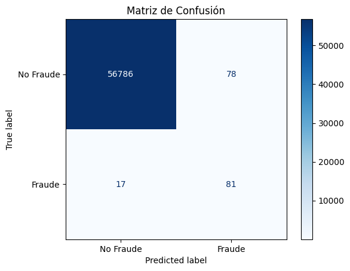
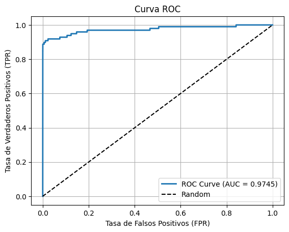

# 🕵️‍♂️ Detección de Fraude en Transacciones con XGBoost

Este proyecto tiene como objetivo detectar transacciones fraudulentas en un conjunto de datos altamente desbalanceado, utilizando técnicas de modelado con XGBoost, ajuste de umbral y evaluación rigurosa.

---

## 📂 Dataset

El dataset utilizado proviene de [Kaggle - Credit Card Fraud Detection](https://www.kaggle.com/mlg-ulb/creditcardfraud), que contiene:

- 284,807 transacciones
- 492 fraudes (≈ 0.172%)
- Variables V1–V28 generadas por PCA, más `Amount`, `Time` y `Class` (target)

---

## ⚙️ Proceso del proyecto

### 1. **Análisis exploratorio (EDA)**

- Se analizaron las distribuciones de `Amount` y `Time`
  - `Amount`: distribución fuertemente sesgada a la derecha
  - `Time`: distribución bimodal (actividad en dos franjas horarias)
- Se generó un **heatmap de correlación**
  - La mayoría de las variables PCA están desacopladas
  - Algunas variables tienen leve correlación con la clase (`V14`, `V10`, `V11`, `V17`…)

---

### 2. **Modelo base con XGBoost**

- Se utilizó `XGBClassifier` con:
  - `scale_pos_weight` ajustado como `negativos / positivos * 1.3`
  - `max_depth = 4`, `learning_rate = 0.1`, `n_estimators = 300`
  - Regularización: `reg_alpha = 0.5`, `reg_lambda = 1`
- Métrica usada: `logloss`
- Se aplicó **validación cruzada estratificada (`StratifiedKFold`)**

---

### 3. **Ajuste del umbral de decisión**

- Se utilizó `cross_val_predict` con `predict_proba`
- Se ajustó el **threshold a 0.35** para mejorar el recall sin dañar mucho la precisión

---

### 4. **Resultados Finales**

**Conjunto de test (20% hold-out):**

| Métrica       | Valor     |
|---------------|-----------|
| F1-score clase 1 (fraude) | **0.8193** |
| Precision clase 1         | 0.8947     |
| Recall clase 1            | 0.7556     |
| Accuracy total            | 0.9995     |
| Falsos negativos          | 22 de 90   |
| Falsos positivos          | 8 de 56,656|

📈 **Matriz de confusión:**

📈 **Curva ROC:**

---

## 🔍 Importancia de Variables

Se utilizó `plot_importance` para identificar las variables más influyentes:

- `V14`, `V10`, `V12`, `V19`, `V17`, `Amount` fueron las más relevantes.
- Se evaluaron posibles eliminaciones de variables con `gain` bajo para simplificar el modelo, sin pérdida significativa de rendimiento.

---

## 🔬 Técnicas probadas pero descartadas

Se exploraron y **descartaron por empeorar resultados**:

- **SMOTE**, **RandomOverSampler** y **ADASYN**
  - Introducían ruido o sobreajuste
- **Undersampling** de clase 0
  - Pérdida de información útil

---

## ✅ Conclusión

El modelo final:
- Logra un excelente balance entre **recall** (detección de fraude) y **precisión** (pocos falsos positivos)
- No necesita oversampling ni ingeniería sintética
- Es robusto, interpretable y eficiente

